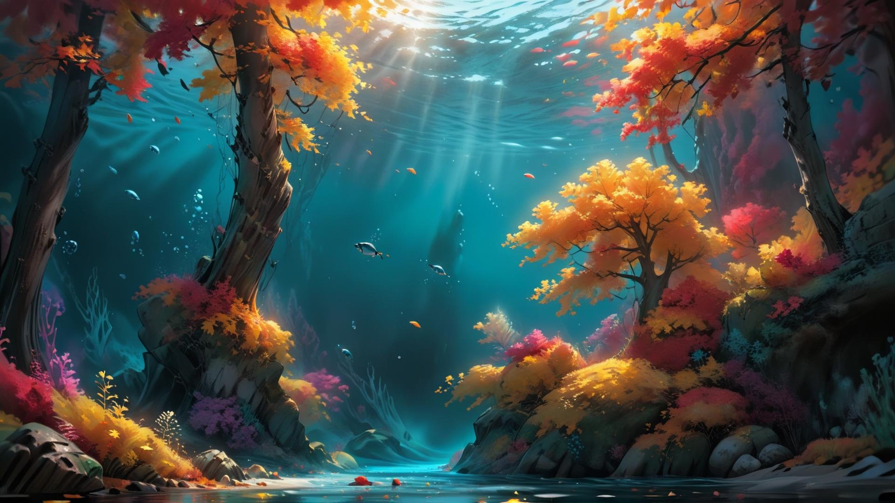
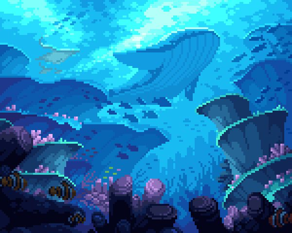
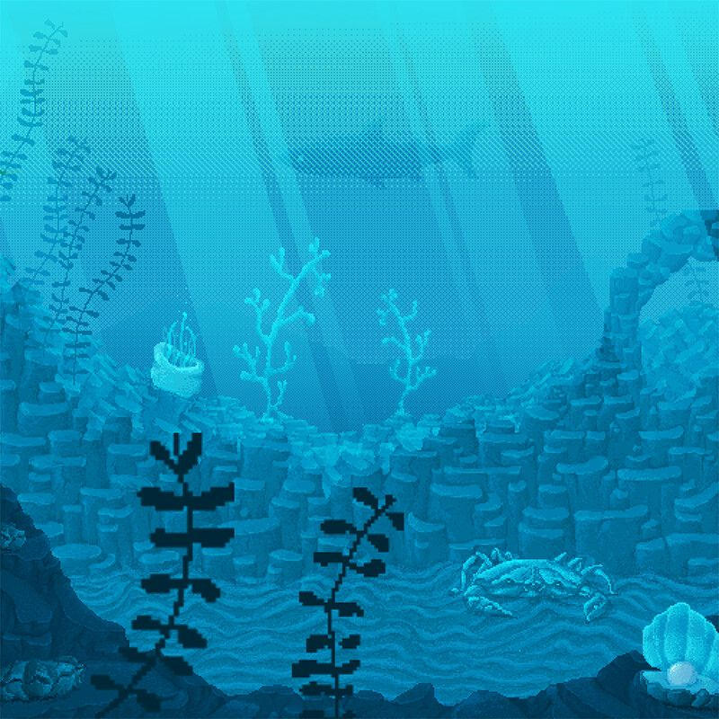
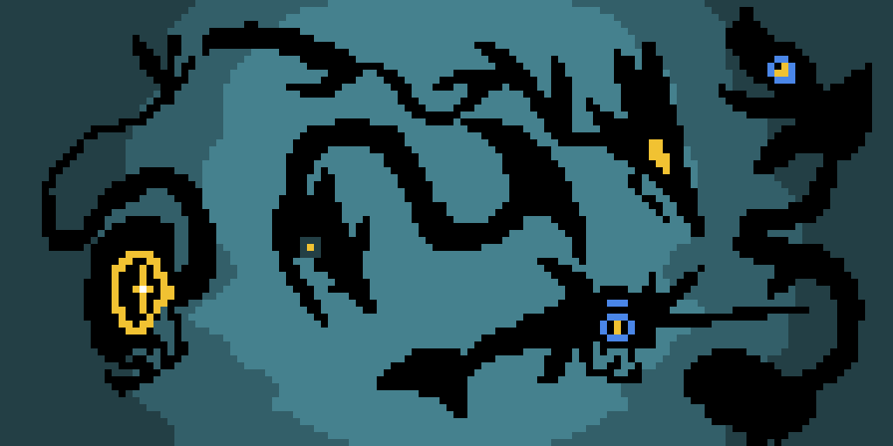
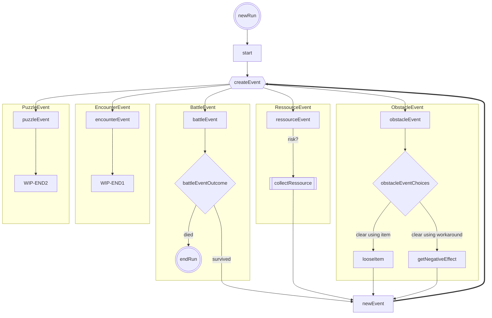

# MantaDive

  

    Filled google form @28.10.2024
  

  
  ### Group name*
  Manta Dive
  
  ### Game genre*
  Idle Game
  
  ### Core concept of your game*
  You control your Manta to dive underwater in a Dungeon Crawler-esque style with the goal of collecting resources and animal friends while making it back to your home base alive. The collected resources and items can then be spent / equipped to allow for deeper dives in future sessions.
  
  ### Gameplay (explain with an example please)*
  A "run" consists of one dive, starting either at the surface of the sea or later at a deeper point unlocked using meta progression. Along your dive towards deeper areas, you can encounter a multitude of different events. These events range from simple resource collection, obstacles, puzzles, interaction with different friendly sea creatures (eg. hand over some ressources to help them with a problem in return they help you in some way/ dont help them and get a negative outcome now or at a later point), all the way to fights that could end your run. At certain points, you can decide whether or not to push further into the depths hunting for rarer and stronger materials to upgrade your manta or to return to the surface, saving the progress gained in that dive and allowing for the use of the found resources.
  
  The maximum depth reached across all your runs can be displayed on a leaderboard to compare your accomplishments with other players. This could include items used in that run.
  
  ### Meta progression (explain with an example please)*
  The meta progression of the game is created through the upgrade system, usable items and animal friend expeditions to enable deeper dives in future runs. 
  
  Examples for possible upgrades can be the ability to start the session at a deeper depth, or increased health.
  Examples for possible items could be consumable items that prevent a bad event outcome once, or items that increase the number of resources you find.
  Animal friend expeditions will passively generate both resources and items at a lower rate even while the game is closed. 
  
  ### Asset requirements (if you need any 2D/3D/UI assets)*
  The assests required revolve mostly around the scenery and encountered events.
  
  Differents depths might use a different backgrounds to visualize the progress
  The ressources and creatures found need to have their on sprites
  To match the visuals different sound effect/music might be used to convay the events feel
  
  ### Anything else?
  -

  

    Moodboard (WIP)
  

  
  
  
  
  

  

    Events
  

  

  

